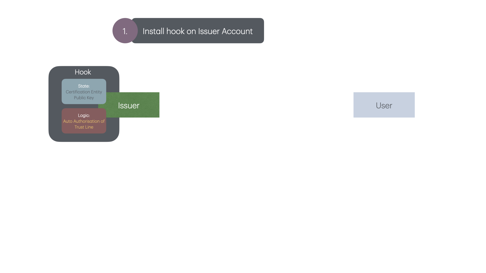
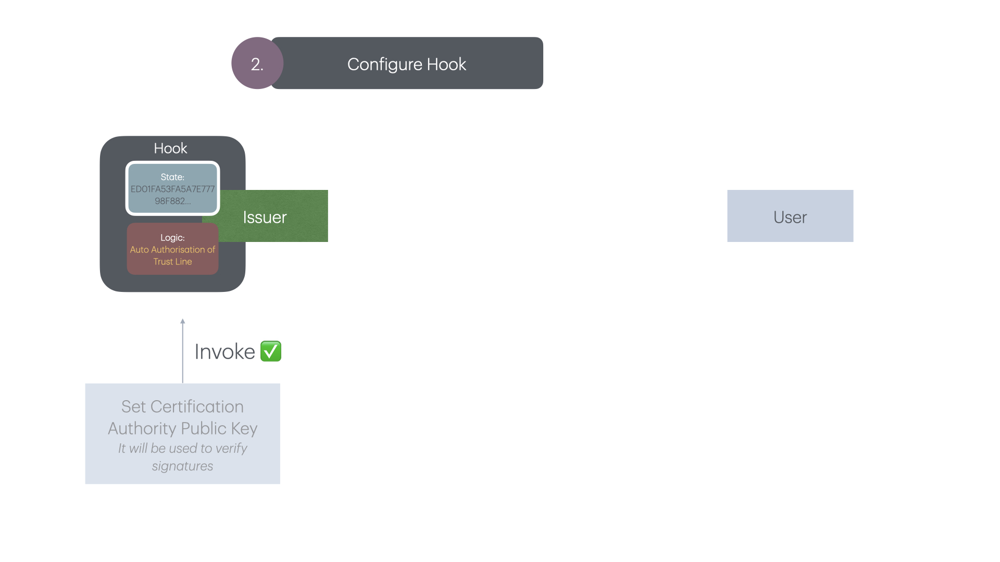
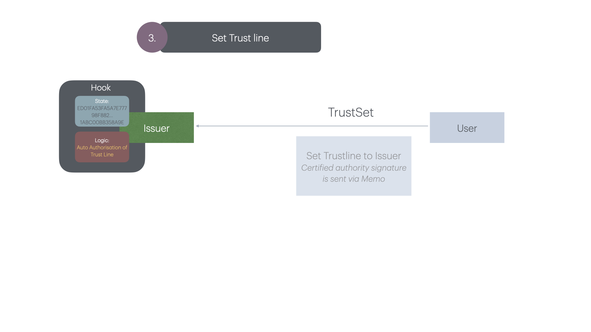
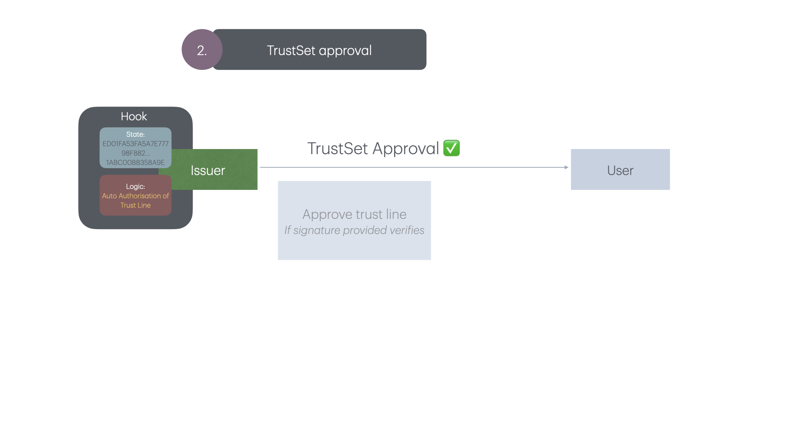

# Authorized Trustlines Auto Approver

## Problem
With Authorized Trustlines, cold wallets can't be that *cold* as they need to come online to approve trustlines.

## Idea
A weak execution of the issuer hook in a post `ttTrustSettransaction` that auto-approves trustlines after verifying a signature (by an issuing entity or authority).

If this check passes, a `TrustSet` transaction from the issuer to the user would be emitted.

The issuing account needs the `asfTshCollect` flag set and the issuer hook the `hsfCollect` flag.

## Setup

### 0. Prerequisites

- Install dependencies: `yarn`
- Rename `.env.example` to `.env`
- Generate two accounts from the [JS Hooks Faucet](https://jshooks.xahau-test.net/) and add them to the `.env` file.

### 1. Install Hook on Issuer Account

`yarn deploy` will configure the issuer acount and deploy the hook on it.

### 2. Configure Hook

`yarn update-key ED01FA53FA5A7E77798F882ECE20B1ABC00BB358A9E55A202D0D0676BD0CE37A63` will configure the hook to store and use the passed public key to verify the signatures on `TrustSet` transactions.

### 3. Set Trustline from User to Issuer

`yarn trust-set 4AD8F6BECCD32C107C0E6A17D317A7357A64835F087DC65CA7013D56ABC2500D80356D332D2F5ADE56837594310687585B83E606E3C33AA43BE409C0AF9D0901` will issue a `TrustSet` transaction from the user to the issuer account.

The signature to be passed to the above command can be generated with `yarn certificate`.

### 4. Auto approval

The hook will be triggered and a `TrustSet` transaction from the issuer to the user will be emitted.
